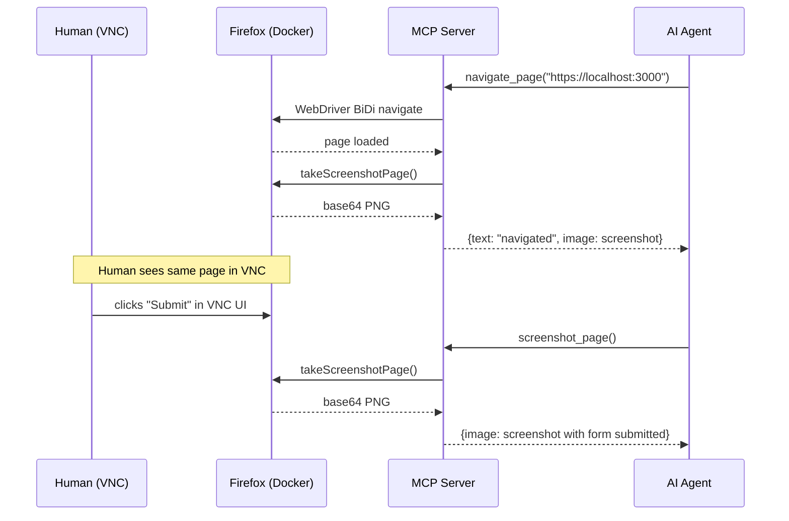

# v0.1.0 — Shared Browser for Humans and AI Agents

## TL;DR

A browser kit that lets AI agents verify their own work — frontends, local dev servers, public sites — while keeping a door open for humans to step in and steer. Two entrypoints (VNC for humans, MCP for agents), one shared Firefox session. Every browser action returns a screenshot automatically.

## Why This Exists

AI agents that build or debug frontend code have no way to see what they shipped. The existing options are:

- **Headless screenshot services** — agent can look but not interact
- **Playwright MCP** — actions work but screenshots are separate calls (3 round-trips per interaction)
- **Cloud browser APIs** — overkill, no co-viewing with a human

We wanted one MCP call = one action + one screenshot, with a human able to take over the same browser at any point. Nothing off the shelf did this.

## Highlights

| What | Why it matters |
|------|---------------|
| Auto-screenshot on 12 mutation tools | Agent sees the result of every click, navigate, and fill — no extra calls |
| noVNC web UI on `:5800` | Human opens the same browser session in any web browser |
| Docker compose included | `docker compose up -d` and you have Firefox with Marionette ready |
| `--connect-existing` mode | MCP server attaches to running Firefox — no browser lifecycle to manage |
| Runtime viewport switching | `set_viewport_size` hot-swaps between mobile/tablet/desktop — no restart needed |

## How It Works



Fork of [Mozilla firefox-devtools-mcp](https://github.com/mozilla/firefox-devtools-mcp) v0.9.1. The only modification is a 20-line middleware in the MCP tool dispatch (`src/index.ts`) that appends a screenshot after every mutation tool call. All 29+ upstream tools work unchanged.

## Token Budget

Screenshot cost scales with viewport. Pick the viewport that fits the task.

| Viewport | Size | Tokens/screenshot | 50 interactions |
|----------|------|-------------------|-----------------|
| Mobile | 390x844 | ~439 | ~22K |
| Tablet | 768x1024 | ~1,049 | ~52K |
| Laptop | 1280x720 | ~1,229 | ~61K |
| Desktop | 1920x1080 | ~2,765 | ~138K |

Formula: `(width x height) / 750 = tokens`. JPEG vs PNG doesn't matter — token cost is calculated from dimensions.

## Configuration

| Flag | Env Var | Default | Purpose |
|------|---------|---------|---------|
| `--connect-existing` | `CONNECT_EXISTING` | `false` | Attach to running Firefox (recommended) |
| `--marionette-port` | `MARIONETTE_PORT` | `2828` | Marionette port for `--connect-existing` |
| `--viewport WxH` | `VIEWPORT` | none | Initial viewport size |
| `--headless` | `FIREFOX_HEADLESS` | `false` | Headless mode (no VNC) |
| `--start-url` | `START_URL` | `about:home` | URL to open on launch |

## Install

```bash
npx firefox-docker-mcp --connect-existing --marionette-port 2828
```

## Files Changed

This is the initial release. Key files:

- `src/index.ts` — MCP server with auto-screenshot middleware (the core 20-line addition)
- `docker/docker-compose.yaml` — Firefox container with Marionette enabled
- `test-e2e.mjs` — End-to-end test proving text+image response
- All other `src/` files — unmodified fork of firefox-devtools-mcp v0.9.1

**Full source:** https://github.com/luutuankiet/firefox-docker-mcp
