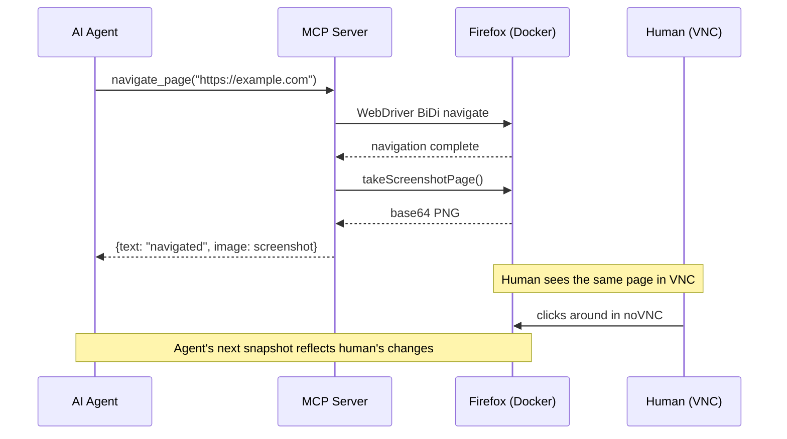

# v0.1.0 -- Shared Browser for Humans and AI Agents

## TL;DR

Fork of Mozilla's `firefox-devtools-mcp` that auto-appends a screenshot to every mutation tool response. One MCP call = one browser action + one screenshot. Firefox runs in Docker with two entrypoints: human via VNC, agent via MCP -- same session, same tabs, same state.

## Why This Exists

AI agents that build or debug frontends need to *see* the result of their work. The upstream `firefox-devtools-mcp` can do this, but it takes 3 round-trips per interaction: action, then screenshot, then read. At 50 interactions in a debug session, that's 150 MCP calls and ~3,600 tokens of overhead per cycle just for the protocol dance.

Meanwhile, the human watching the agent work has no way to see the same browser -- they'd need to open a separate instance and navigate manually to cross-check.

This project solves both: one Firefox session that both human and agent can drive, with every agent action returning visual proof in a single call.

## Highlights

| Change | What it does | Why it matters |
|--------|-------------|----------------|
| Auto-screenshot middleware | 20-line wrapper in tool dispatch that appends a page screenshot after every mutation tool | 3 round-trips per interaction becomes 1 |
| Docker compose with Marionette | `jlesage/firefox` pre-configured with `--marionette` and persistence | One `docker compose up -d` to a working browser |
| Human + agent shared session | VNC web UI on `:5800`, MCP via Marionette on `:2828` | Both see the same tabs, cookies, page state |
| Runtime viewport switching | `set_viewport_size` is a mutation tool -- also auto-screenshots | Test mobile, tablet, desktop without container restart |

## How It Works



## Before / After

**Before (upstream firefox-devtools-mcp):**
```
Agent: call navigate_page(url: "https://example.com")
  -> {text: "navigated to https://example.com"}

Agent: call screenshot_page()
  -> {image: <base64 PNG>}

# 2 calls, agent must remember to screenshot after every action
```

**After (this fork):**
```
Agent: call navigate_page(url: "https://example.com")
  -> {text: "navigated to https://example.com", image: <base64 PNG>}

# 1 call, screenshot is automatic
```

## Mutation Tools with Auto-Screenshot

| Tool | Action |
|------|--------|
| `navigate_page` | Go to URL |
| `new_page` | Open tab |
| `click_by_uid` | Click element |
| `hover_by_uid` | Hover element |
| `fill_by_uid` | Type into input |
| `drag_by_uid_to_uid` | Drag and drop |
| `fill_form_by_uid` | Fill multiple fields |
| `upload_file_by_uid` | Upload file |
| `accept_dialog` / `dismiss_dialog` | Handle browser dialogs |
| `navigate_history` | Back / forward |
| `set_viewport_size` | Resize viewport |

## Token Economics

Screenshot cost scales with viewport. Agent picks the right viewport for the task at runtime.

| Viewport | Size | Tokens/screenshot | 50 interactions |
|----------|------|-------------------|-----------------|
| Mobile | 390x844 | ~439 | ~22K |
| Tablet | 768x1024 | ~1,049 | ~52K |
| Laptop | 1280x720 | ~1,229 | ~61K |
| Desktop | 1920x1080 | ~2,765 | ~138K |

Formula: `(width x height) / 750 = tokens`

## Configuration

| Setting | Value | Where |
|---------|-------|-------|
| Docker image | `jlesage/firefox` | `docker/docker-compose.yaml` |
| Display canvas | 1920x1080 | `DISPLAY_WIDTH` / `DISPLAY_HEIGHT` env |
| Marionette port | 2828 | `FF_PREF_MARIONETTE_PORT` env |
| MCP transport | stdio | `--connect-existing --marionette-port 2828` |
| npm package | `@luutuankiet/firefox-docker-mcp` | `npx @luutuankiet/firefox-docker-mcp` |

## Install

```bash
# Docker
cd docker/ && docker compose up -d

# MCP server
npx @luutuankiet/firefox-docker-mcp --connect-existing --marionette-port 2828
```

## Files Changed

| File | Summary |
|------|---------|
| `src/index.ts` | Auto-screenshot middleware -- `MUTATION_TOOLS` set + post-handler screenshot append |
| `docker/docker-compose.yaml` | jlesage/firefox with Marionette, host network, 1920x1080 canvas |
| `package.json` | Scoped to `@luutuankiet/firefox-docker-mcp`, build scripts |
| `test-e2e.mjs` | End-to-end test proving text+image response |
| `src/` (forked) | Full fork of `firefox-devtools-mcp` v0.9.1 (29 tools) |
| `.github/workflows/publish.yml` | npm OIDC publish pipeline |

## Upstream

Fork of [Mozilla firefox-devtools-mcp](https://github.com/mozilla/firefox-devtools-mcp) v0.9.1 (MIT).
